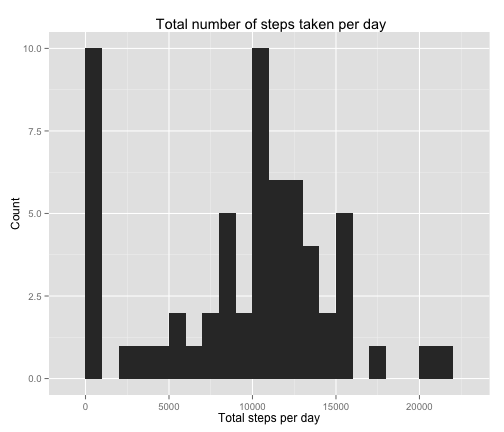
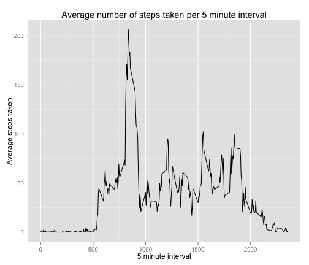
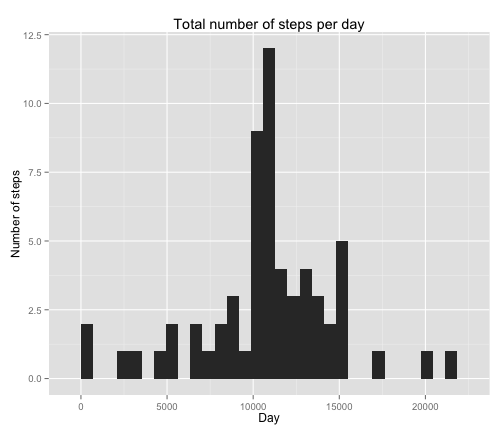

Peer Assignment #1: Activity monitoring
========================================================

## Getting data


```r
activity <- read.csv("~/activity.csv")
```

## Plot mean total number of steps taken per day

```r
library(ggplot2)
total_steps_perday <- tapply(activity$steps,activity$date, sum,na.rm = TRUE)
g <- qplot(total_steps_perday, binwidth = 1000)
g + labs(title = " Total number of steps taken per day") + labs (x = "Total steps per day") +  labs (y = "Count")
```

 

## Calculate mean and median of the total number of steps taken per day

```r
mean(total_steps_perday, na.rm = TRUE)
```

```
## [1] 9354
```

```r
median(total_steps_perday, na.rm = TRUE)
```

```
## [1] 10395
```

## Average daily activity pattern 

```r
library(ggplot2)
average_daily_pattern <- aggregate(list(steps=activity$steps),by = list(interval = activity$interval), mean, na.rm = TRUE)
ggplot(average_daily_pattern,aes(x = interval, y= steps)) +
 geom_line() + 
 labs(title = "Average number of steps taken per 5 minute interval", x = "5 minute interval", y = "Average steps taken")
```

 

## Calculate maximum number of steps on an average for 5 minute interval

```r
average_daily_pattern[which.max(average_daily_pattern$steps),]
```

```
##     interval steps
## 104      835 206.2
```

## Imputing missing values: a) Number of missing values by columns

```r
colSums(is.na(activity))
```

```
##    steps     date interval 
##     2304        0        0
```

## Imputing missing values: b) Impute values

```r
Impute_values <- function(steps,interval)
    {
    impute <- NA
    if (!is.na(steps))
        impute <- c(steps)
    else
        impute <- (average_daily_pattern[average_daily_pattern$interval == interval, "steps"])
                return(impute)
     }           
Imputed_values <- activity
Imputed_values$steps <- mapply(Impute_values, Imputed_values$steps, Imputed_values$interval)
```

## Imputing missing values: c) Plot histogram

```r
total_steps_per_day <- aggregate(list(steps = Imputed_values$steps), by = list(date = Imputed_values$date), sum, na.rm = TRUE )
library(ggplot2)
qplot(steps, data = total_steps_per_day) +
    labs(title = "Total number of steps per day", y = "Number of steps", x = "Day")
```

```
## stat_bin: binwidth defaulted to range/30. Use 'binwidth = x' to adjust this.
```

 


## Impute missing values: d) calculate mean & median 

```r
mean(total_steps_per_day$steps, na.rm = TRUE)
```

```
## [1] 10766
```

```r
median(total_steps_per_day$steps, na.rm = TRUE)
```

```
## [1] 10766
```

The mean and median values surge post imputation.

## Differences in weekdays and weekends 

```r
daytype <- function(date)
    {
     type_day <- weekdays(date)
     if (type_day %in% c("Saturday", "Sunday"))
         return("Weekend")
     else 
         return ("Weekday")
    }

Imputed_values$date <- as.Date(Imputed_values$date)
Imputed_values$day_type <- sapply(Imputed_values$date, daytype)
```

## Time series plot

```r
library(ggplot2)
average_daily_pattern_with_daytype <- aggregate (steps ~ interval + day_type, data = Imputed_values, mean)
average_daily_pattern_with_daytype$interval <- as.numeric(average_daily_pattern_with_daytype$interval)
average_daily_pattern_with_daytype$steps <- as.numeric(average_daily_pattern_with_daytype$steps)
average_daily_pattern_with_daytype$day_type <- as.factor(average_daily_pattern_with_daytype$day_type)
ggplot(average_daily_pattern_with_daytype, aes(x = interval, y = steps)) + 
    geom_line() +
    facet_grid(day_type ~.) +
    labs (tite = "Average number of steps" , x = "Interval", y = "Number of steps")
```

 

